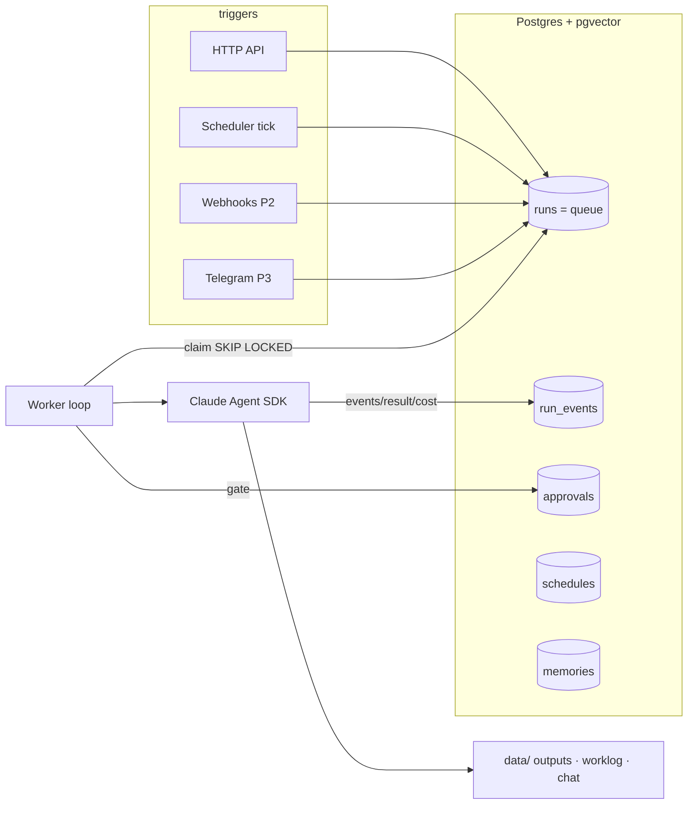

# RFC-0001: agentic-octopus — the spine for personal agentic applications

- **Status:** draft
- **Author:** Diego Silva   **Date:** 2026-07-15
- **Reviewers/Decider:** Decider: Diego (owner-decided mode)
- **Related:** ADR-0001..0006, `skills/` (working discipline this system inherits)

## Summary

Build one orchestration service — a FastAPI gateway, a Postgres-backed job queue, and workers
that execute agents through the Claude Agent SDK — as the shared spine for every future agentic
application (productivity, infra ops, research, life admin). Each application becomes a small
declarative directory (`agents/<name>/`) plugged into shared triggering, state, consent gates,
and memory. Runs locally under docker compose today; deploys to GCP (Cloud Run + Cloud SQL)
later without redesign. Cost: one service to maintain and a Postgres instance; the payoff is
that agent #2 through #N are two files each.

## Problem

Every agentic app needs the same plumbing: something to trigger it (schedule, API call, event),
somewhere to record what it did (state, transcripts, cost), a way to pause for human consent
before side effects, and memory across runs. Built per-app, that plumbing is re-solved — and
re-debugged — every time, and each app ends up with its own half-safe consent story. The spine
solves it once, with the safety philosophy already encoded in this repo's skills (preflight
consent, evidence, worklog) enforced by construction.

## Goals / Non-goals

**Goals**

- One service through which all agents are triggered, observed, and gated.
- Four trigger types over time: HTTP API, cron scheduler, inbound webhooks, chat.
- Durable approval gates: a run can park indefinitely awaiting explicit human consent.
- Trivial agent onboarding: new app = `agents/<name>/agent.yaml` + `prompt.md`.
- Hybrid runtime: identical containers locally (compose) and on GCP (Cloud Run) later.
- Full audit: every run's transcript, tool calls, cost, and consent decisions in Postgres.

**Non-goals**

- No Kubernetes, no Redis, no microservices — solo-operator simplicity is a design constraint.
- No multi-user/multi-tenant anything.
- No web UI yet (the CLI and API are the interface; a read-only dashboard is a late phase).
- No general workflow DAG engine — agents are single SDK sessions; composition comes later if
  reality demands it.

## How this works today (primer)

Two mechanisms carry the whole design:

1. **Postgres as a queue.** `SELECT ... FOR UPDATE SKIP LOCKED` lets N workers each atomically
   claim a different queued row with no broker: a worker locks a row, others *skip* locked rows
   instead of waiting. Combined with a lease column (`lease_expires_at`), a crashed worker's run
   is safely re-claimed after its lease expires.
2. **Agent SDK sessions are resumable.** A headless run (`query(...)`) returns a `session_id`.
   If an agent must pause for consent, we end the session, store the id, and resume later with
   `ClaudeAgentOptions(resume=session_id)` — which is what makes approval gates durable rather
   than "the process waits on stdin".

## Proposed design



- **API (FastAPI):** `POST /agents/{name}/run` (enqueue), `GET /runs[/{id}[/events]]`,
  `POST /runs/{id}/approve|reject`, `GET/POST /schedules`, `GET /healthz`. Auth: static bearer
  token; replaced by IAM at the GCP phase.
- **Worker:** async loop — claim → load definition → execute via SDK → stream events into
  `run_events` → persist result/cost/session_id → complete/fail. Heartbeats extend the lease
  during long runs; a reaper re-queues expired leases.
- **Scheduler:** an asyncio task inside the worker (one fewer container). Every 30s, claim due
  `schedules` rows (`FOR UPDATE SKIP LOCKED` again), insert a run, compute `next_run_at` via
  croniter — atomic, so N workers never double-fire.
- **Agent definitions (ADR-0006):** `agent.yaml` (name, tools allowlist, max_turns,
  requires_approval, default schedule, params, output dir) + `prompt.md` (system prompt).
  Validated by pydantic at startup; mapped to `ClaudeAgentOptions` with `setting_sources=[]`
  so server runs are isolated from any filesystem Claude settings.
- **Consent gates (ADR-0005), two tiers:**
  - *M1 — pre-execution:* `requires_approval: true` → on claim, insert pending `approvals` row,
    park run in `awaiting_approval`. Approve (CLI/API) flips it back to `queued`.
  - *P2 — mid-run:* expose a `request_approval(action, payload)` tool to the agent via the SDK's
    in-process MCP server; worker records the request, stores `session_id`, parks the run.
    Approval re-enqueues; executor resumes the session. Same tables, same states.
- **CLI (`octo`):** thin httpx client — `run`, `runs`, `status`, `logs`, `approve`, `reject`,
  `schedule list|sync`, plus `db upgrade` (direct DB).

### Data model (shipped in `db/migrations/0001_init.sql`)

A **run row is the queue item** — no separate jobs table to keep in sync. States:

```
queued ──claim──▶ running ──▶ completed | failed
running ──gate──▶ awaiting_approval ──approve──▶ queued (resumes)
awaiting_approval ──reject──▶ rejected
queued|awaiting_approval ──cancel──▶ cancelled
running ──lease expired──▶ queued (attempts < max_attempts) | failed
```

Claim query (the load-bearing SQL):

```sql
UPDATE runs SET status='running', locked_by=%(worker)s, attempts=attempts+1,
       started_at=COALESCE(started_at, now()), lease_expires_at=now()+interval '15 minutes'
WHERE id = (SELECT id FROM runs WHERE status='queued' AND available_at <= now()
            ORDER BY created_at LIMIT 1 FOR UPDATE SKIP LOCKED)
RETURNING *;
```

Tables: `runs`, `run_events` (append-only audit), `approvals`, `schedules`, `memories`
(pgvector `embedding vector(1536)` — unused until the semantic-recall phase; the HNSW index is
added then, not before). Every status change writes a `run_events` row; transitions are enforced
by a single guard function, not scattered UPDATEs.

### Why this number / that choice

- **15-minute lease:** longer than any sane brief-style run segment, short enough that a crashed
  worker's run resumes the same hour. Tune with evidence.
- **`max_turns` per agent:** the cost-runaway backstop; every run also records `cost_usd`.
- **`vector(1536)`:** matches the common embedding dimension; revisit at the memory phase.

## Alternatives considered

- **Per-app cron scripts** — fastest start; re-solves state/consent/observability per app, and
  the fifth script is where it collapses. Rejected: the spine IS the point.
- **Temporal / Prefect** — real workflow engines with durable execution. Overkill: heavy infra,
  their own concept load, and consent-gating still ends up custom. Rejected for solo scale;
  revisit only if agents need true multi-step orchestration with retries per step.
- **n8n / no-code automation** — great glue, but agent runs here are SDK sessions with tools and
  gates, not HTTP hops; core logic would live outside git. Rejected.
- **Redis + Celery/arq** — the conventional queue stack; adds a second stateful service and its
  ops surface for throughput this system will never need. Postgres SKIP LOCKED covers it
  (ADR-0003). Rejected.

## Risks & mitigations

- **Single Postgres is a SPOF** → acceptable at this scale; compose volume + (GCP phase)
  Cloud SQL automated backups. Nothing else to lose.
- **Agent SDK is 0.x, API may churn** → executor is behind a Protocol (`AgentExecutor`);
  the SDK touchpoint is one class, and tests use a fake.
- **Cost runaway** (agent loops, searches forever) → `max_turns` per manifest, cost recorded per
  run, scheduler defaults conservative. Later: budget alerts.
- **Secrets in a server context** → env/.env locally, Secret Manager at GCP phase; repo ships
  /secrets-check and `.env` is gitignored from commit one.
- **A side-effectful agent without a gate** → `requires_approval` defaults conservative;
  hard rule in CLAUDE.md: agents never self-approve, and side-effectful tools require a gate.

## Rollout plan

- **M0 (this change):** docs + scaffold + schema + healthz stack. No external effects.
- **M1 — walking skeleton (2–3 sessions, each independently mergeable):**
  1. queue/models/db + integration tests (claim semantics proven first);
  2. registry + executor (Protocol, Fake, ClaudeSDK impls);
  3. API routes + auth + approvals;
  4. worker loop + scheduler + pre-execution gates;
  5. CLI + research-brief live + smoke evidence in worklog.
- **P2:** inbound webhooks (`POST /hooks/{source}`, HMAC) + mid-run gates via MCP tool + resume.
- **P3:** Telegram bot — deliver briefs, inline approve/reject buttons on the same approvals API.
- **P4:** ⚠️ **GCP deploy (consent gate — first prod-touching step):** Cloud Run (api, worker),
  Cloud SQL Postgres + pgvector, Secret Manager; CI gains a deploy stage gated on manual action.
- **P5:** semantic memory — embed results/notes into `memories.embedding`, HNSW index, `recall`
  tool exposed to agents.
- **P6:** read-only dashboard.

## Decisions

- [ ] **Run-row-as-queue-item** (no jobs table) — *recommended: yes; one source of truth, the
  queue poll is one indexed query.*
- [ ] **Scheduler inside the worker process** (no third service) — *recommended: yes at this
  scale; split it out only if worker crashes start eating schedule ticks.*
- [ ] **Agent format = YAML manifest + prompt.md** with optional per-agent `hooks.py` escape
  hatch later — *recommended: yes; declarative keeps onboarding two files.*
- [ ] **Raw SQL + numbered migrations** (no ORM/Alembic) — *recommended: yes; the queue is raw
  SQL anyway; fall back to Alembic if migrations get painful.*
- [ ] **Make over just** — *recommended: yes; preinstalled everywhere you migrate.*

## Glossary

- **Agent** — a declarative definition (yaml + prompt) executed as a Claude Agent SDK session.
- **Run** — one execution of an agent; also the queue item; carries transcript, cost, result.
- **Gate** — a pending approval that parks a run until explicit human consent.
- **Schedule** — a cron expression that enqueues runs for an agent.
- **Spine** — this service: shared triggering, state, consent, and memory for all agents.
- **Brief** — the research-brief agent's markdown output; the walking skeleton's proof artifact.
